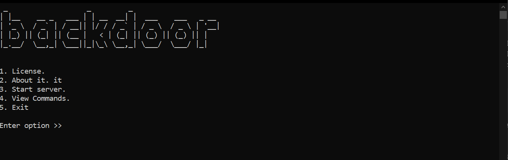

# BACKDOOR

This is a simple client-server application, capable of executing certain tasks that are sent from the server to the client.

It is the first version so it is possibly very basic and there are still errors that need to be corrected.

## How do I use it?
The main file "main.py" is located inside the server folder.

For this I assume that you know how to use python at least at a basic level.

Run "main.py" and install the dependencies listed in "requirements.txt" and a menu like the following will appear:

1. Index number 1 is about the license of the program. It is worth
2. mentioning that this project is free so you can edit it.
3. Index number 2 is the README.md
4. Index number 3 starts the server as a terminal
5. Index number 4 shows the commands and flags that can be used on the server.
6. Index number 5 ends the program.

## How do I use the server?

Below is a table of the commands and flags that can be used on the server.

This tool is made for educational purposes.

If you want to generate an executable file for the client, then you need to enter the command:

        generate app

        or

    If you want a different name

        generate app --name archivo

By default it uses a "windows.ico" icon located in the server folder, however you can replace this file with another image but with the same name and the result will take that icon

The executable has been tested on virusTotal with a result of 5/62

Existe un archivo clientSetting.json en la carpeta "cliente", este archivo se genera automáticamente al usar el comando "generate app", sin embargo puede crearlo manualmente si desea ejecutar "run.py" desde la carpeta "cliente", ya que por defecto el servidor que intetaran conectarse es a:

    host="localhost"

    port=9999